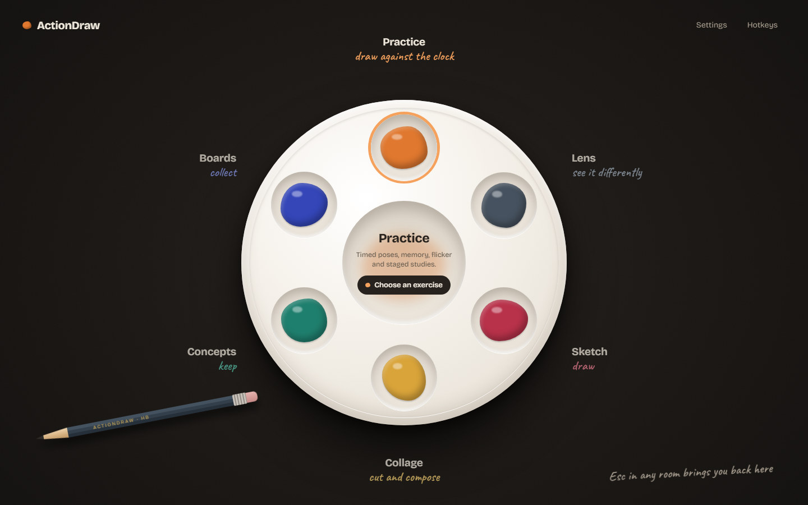
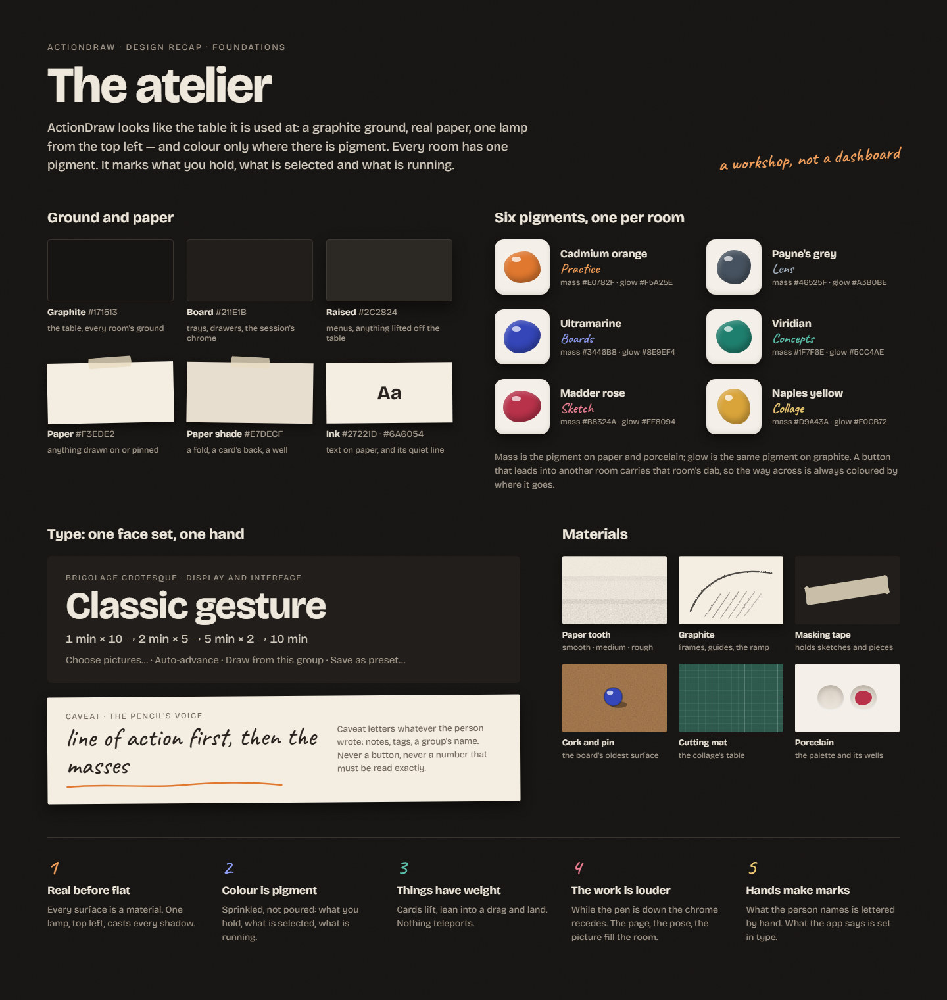
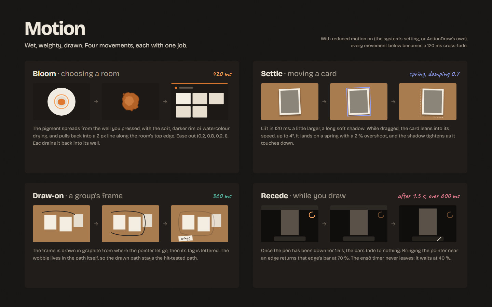
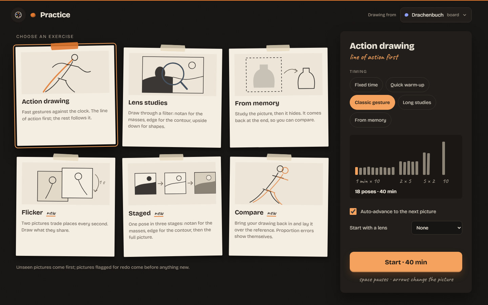
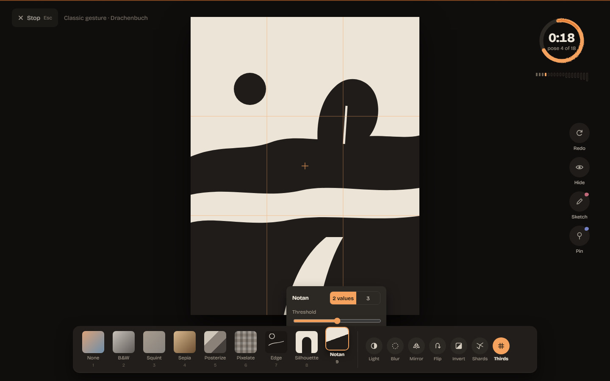
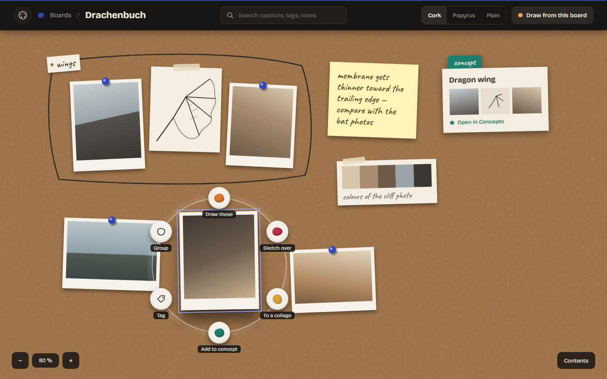
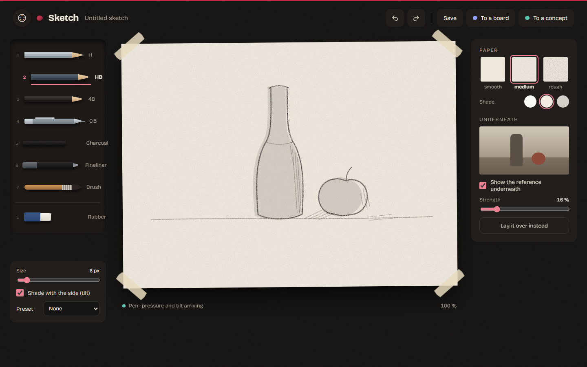
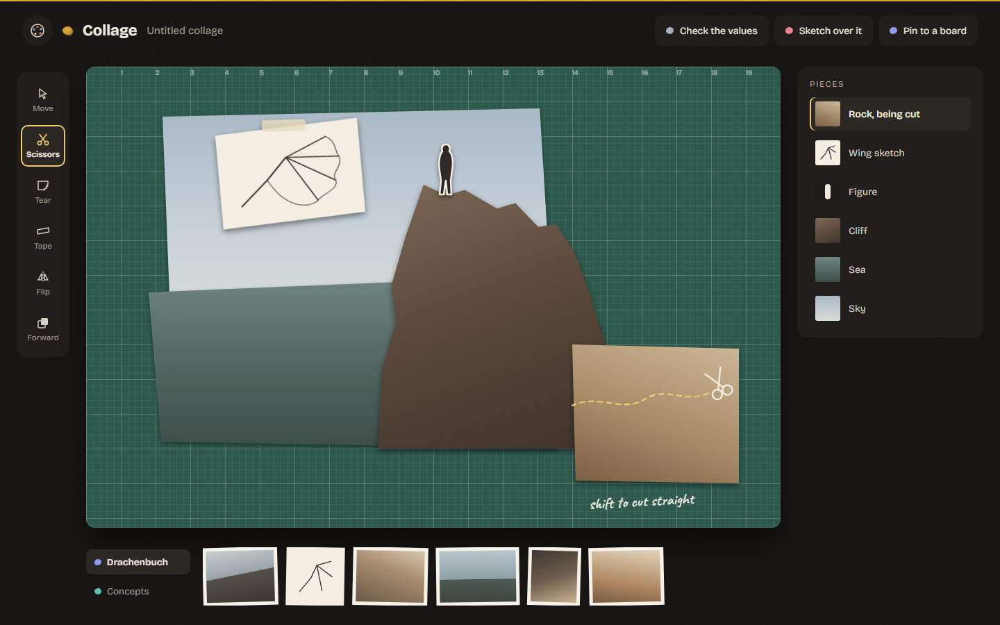

# Design recap — the atelier (2026-10-05)

The design behind [CONCEPT.md](../../CONCEPT.md) and the roadmap's M8 and M9, kept in the repo
so it survives the canvas it was made on.

- **The canvas:** [ActionDraw Design Recap](https://claude.ai/artifact/3xcFe4wp1GsbdemkbU3zn4) —
  a claude.ai Design artifact, private to its owner until shared from its Share menu. The home
  board there is clickable (select a well, open a room).
- **[ActionDraw-Design-Recap.zip](ActionDraw-Design-Recap.zip)** — the canvas as it was archived:
  - `project/` — the canvas's own files: `canvas.json` (the layout) and one `.dc.html` per board.
    Publishing these files under `project/` to a new canvas made from the Design artifact type
    brings the canvas back as it was.
  - `static/` — the same boards as plain HTML pages that open in any browser. These are not
    interactive, and they need Google Fonts online for the type.
- **[previews/](previews)** — every board rendered from `static/` with headless Edge at
  1440 px wide. The home board is shown in its default state, with Practice selected.

## The boards

| | |
|---|---|
| **Home — the palette.** Six wells round a porcelain mixing palette, one per room; the centre well shows the selected room and its next step. |  |
| **Foundations — the atelier.** Ground and paper, the six pigments (mass and glow), the type, the materials, five principles. |  |
| **Motion — wet, weighty, drawn.** Bloom, settle, draw-on and recede, each with its timing. |  |
| **Practice — choosing an exercise.** Taped index cards, and the ramp drawn as graphite bars. |  |
| **Practice — in a pose.** The ensō timer, the lens tray with keys, Notan's parameters. |  |
| **Boards — the mood board.** Prints and pins, a graphite group frame, a concept card, the ring menu. |  |
| **Sketch — the drawing board.** The pencil tray, papers as real tooth, the picture underneath. |  |
| **Collage — the cutting mat.** Cut and torn pieces, scissors on a marching-ants path, sources from boards and concepts. |  |

Picture contents on the boards are placeholders (tonal fields and simple ink drawings), not real
material. *Drachenbuch* is the one real board name.
